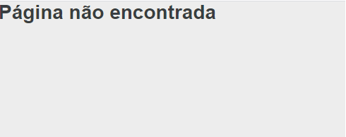

# Desafio Huia
Este projeto foi desenvolvido para o teste técnico da empresa Huia.
### Principais tecnologias utilizadas:
 - ReactJS
 - React Router Dom
 - Styled Components
 ### Primeiro Passo
 Baixe o repositório em sua máquina utilizando o comando
 ```
 git clone https://github.com/douglaspujol/huia.git
 ```
 Na raiz do projeto, execute o comando "yarn" para baixar todas as dependências.
 ```
yarn
 ```
Depois de finalizar todos os downloads, execute yarn start para rodar localmente o seu projeto.
 ```
yarn start
 ```
Seu projeto estará rodando na URL http://localhost:3000/

## Rotas
Este projeto contém 03 rotas.
- / (Rota Raiz)

- /maxdoctor (Rota do App)

- /404 (Rota não encontrada)


O formulário de login possui verificações conforme as regras exigidas no teste. Os estados da tag Select, são fornecidos através de uma API do https://servicodados.ibge.gov.br/api/v1/localidades/estados
